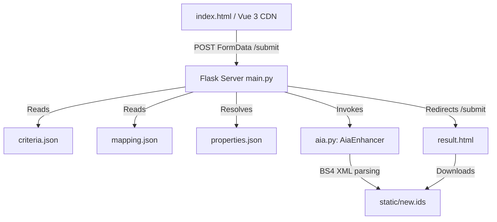

# System Patterns

This section explains the architectural and design decisions implemented in this repository.

## Architecture Overview



## Backend Components (Flask)

- **`main.py`**:
  - Exposes `/` and `/submit` routes.
  - Resolves selected criteria checklist values into Property objects using mappings.
  - Performs external API calls to `via.bund.de` to download the original IDS if a GUID is provided.
  - Saves intermediate uploads to `uploads/`.
- **`aia.py`**:
  - Implements `AiaEnhancer` which uses `BeautifulSoup(content, "xml")` to read, search for property URIs, and write missing property definitions into IDS specs.

## Frontend Components (Vue.js 3 CDN & Tailwind)

- **Jinja2 & Vue Coexistence**:
  - Jinja2 handles the initial template compilation of `index.html`.
  - To prevent conflicts, Vue 3 is configured with custom delimiters:
    ```javascript
    delimiters: ['[[', ']]']
    ```
- **Widescreen Single-Page Layout**:
  - The UI uses Tailwind CSS with RUB blue theme (#17365c) and RUB green (#8dae10).
  - Designed as a two-column grid (`md:grid-cols-2`). Left side: IDS upload / GUID input and building type. Right side: criteria checklist.
- **Whole-Card Click Target & Event Bubble Prevention**:
  - Criteria checkboxes and labels are set to `pointer-events-none` so that clicks on any part of the card wrapper bubble up cleanly and trigger `toggleCriterion(...)` once without double-triggering.
